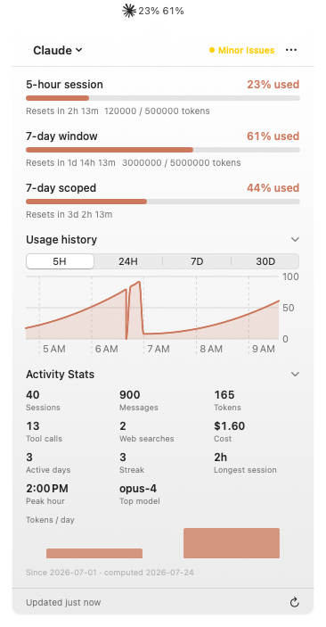
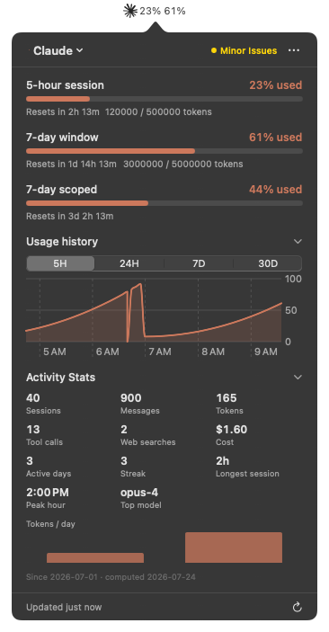

<p align="center">
  
</p>


<h1 align="center">AI Usage Widget</h1>

<p align="center">
  <a href="https://www.opendesktop.org/p/2361382/">
    
  </a>
  
  <a href="LICENSE">
    
  </a>
  <br/>
  <a href="https://www.opendesktop.org/p/2361382/">
    
  </a>
  
</p>

A KDE Plasma 6 panel widget for tracking AI API quota usage across multiple services. Monitor your **Claude** subscription windows and local activity stats, **Antigravity/Google AI Studio**, **OpenAI API and Codex plan limits**, **Grok CLI**, **Kiro**, **Mistral AI**, **OpenRouter**, **Z.AI**, **GitHub Copilot**, **DeepSeek**, **Kimi / Moonshot AI**, and **Muse** usage or balance at a glance with animated segmented bars, live countdown timers, account status, and per-model breakdowns.


## Screenshots

### Panel

| Claude | Antigravity |
| :---: | :---: |
|  |  |

### Popup

| Claude | Antigravity |
| :---: | :---: |
|  |  |
| **OpenAI** | **Usage history** |
|  |  |
| **Overview** | **Sessions** |
|  |  |
| **Usage & Spend** | **Settings** |
|  |  |

---

## Features

- **Multi-service support** — 14 providers in one popup, each on its own tab
- **Panel view** — Compact percentage readouts in the taskbar, color-coded by usage level, with an inline spark-line trend
- **Popup view** — Segmented bars showing exact fill level with reset times and live countdowns that show "resetting..." when a window flips
- **Usage chart** — Smooth, glowing area chart of historical usage with availability-aware 5H / 24H / 7D choices and hover-scrub
- **Burn-rate ETA** — Estimates time to 100% from your recent trend (e.g. "↗ ~3h to 100%") for each available window
- **Period comparison** — Shows how today/this week compares to the same point last period (e.g. "+12% vs last week")
- **Cost aggregation** — Combined API spend across Claude, OpenAI, and OpenRouter in the footer
- **Model breakdown** — Usage per model for providers that expose it
- **Theme-aware accent** — Follows your Plasma accent color by default, or use per-service brand colors
- **Glassmorphism popup** — Translucent, blurred popup styling, with percentages that roll up and down smoothly
- **Color thresholds** — Amber at 70%, red at 90%
- **Pin services** — Pin one or more tabs so they stay visible on the panel; with no pins, the panel mirrors the active tab
- **History export / import** — Save and restore usage history as JSON; history is mirrored to disk so it survives reinstalls
- **Robust refresh** — Poll interval from 1 to 30 minutes, respects `retry-after` headers, dims and shows the error inline when a fetch fails
- **Optional Overview / Usage & Spend / Sessions tabs** — turn on in Settings → Views. Overview shows every enabled provider at a glance, Usage & Spend totals the API spend figures each provider already reports, and Sessions lists recent local Claude Code / Codex / Grok CLI / Cline / OpenCode / Muse activity — redacted titles and recency only, no paths or transcripts — with a ⧉ button to resume a session in your terminal (`get-ai-usage --sessions` / `--open-session <key>`; not available for Muse, which ships no resume command)

Also runs [on Hyprland](docs/hyprland.md), [on Windows](docs/windows.md), [on macOS](docs/macos.md) and [in a terminal](docs/cli.md) — every frontend shares one backend.

## macOS — native Swift menu bar app

<p align="center">
  
  
</p>

Captured with demo data. See the [macOS guide](docs/macos.md) for usage history,
settings, menu bar styles, and build instructions.

---

## Supported Services

| Service | What the widget shows | Support status |
|---|---|---|
| Claude (Anthropic) | Subscription windows reported by Anthropic, reset times, and local activity stats | Supported |
| Antigravity / Google AI Studio | Overall quota, per-model Gemini usage, and reset times | Supported |
| OpenAI | 30-day API token/cost usage plus Codex/ChatGPT plan limits and account status | Supported |
| Grok (xAI) | CLI billing credits when exposed, free-tier exhaustion, and local session totals | Free tier tested; paid plans unverified |
| Kiro | Monthly credits, remaining balance, reset date, overage, and plan — from kiro-cli's login or the Kiro IDE | Supported |
| Mistral AI | Key status, available models, and local vibe CLI cost/token statistics | Supported |
| OpenRouter | Spend, credit limit, usage percentage, and account label | Untested |
| Z.AI | 5-hour token quota, monthly tools quota, reset countdowns, model details, and today's token consumption | Supported |
| GitHub Copilot | Premium request usage against the plan's own entitlement, the real reset day, and local Copilot CLI activity stats | Personal billing supported; organization/enterprise billing not yet supported |
| DeepSeek | Available balance with granted and topped-up breakdown | Supported |
| Kimi / Moonshot AI | Kimi Code plan windows (5-hour and weekly) and extra-usage wallet; Moonshot API balance with voucher and cash breakdown | Moonshot balance supported; Kimi Code quota tested on a used-up plan only |
| Muse | Local session stats: tokens, offline spend estimate, sessions, tool calls, workspaces, streaks. Plan windows available behind an opt-in switch | Supported (the plan quota costs tokens to read — off by default) |
| Cursor | Included usage for the billing cycle, the Auto/API split, on-demand spend, and plan name | Free login/stats tested; free agent quota unavailable; paid plans unverified |
| Cline | Tokens, sessions and spend for today / 7 / 30 days, plus all-time stats per model and workspace, from the CLI's own session logs | Supported (local stats; account balance not yet shown) |

What each provider needs signed in, and what it reads, is in
**[docs/providers.md](docs/providers.md)**.

---

## Requirements

| Dependency | Notes |
|---|---|
| KDE Plasma 6.0+ | `X-Plasma-API-Minimum-Version: 6.0`. Needed for the widget only — the Hyprland shell and the [terminal frontend](docs/cli.md) run without it |
| `plasma5support` | Provides the `executable` DataEngine for running the backend |
| Python 3.8+ | Runs the shared provider backend (standard library only, no `pip install`). Auto-detected from PATH as `python3`, a versioned `python3.x`, or bare `python`. To pin a specific interpreter — a virtualenv, a non-standard prefix — set it under **Settings → Advanced → Python**, or export `$PYTHON3`. NixOS installs need no PATH entry at all: the flake pins the interpreter at build time |

---

## Install

```bash
git clone https://github.com/Muddyblack/ai-usage-widget.git
cd ai-usage-widget
./translate/build.sh   # compile the translations (needs gettext); skip for English only
kpackagetool6 -t Plasma/Applet -i package
# or to update an existing install:
kpackagetool6 -t Plasma/Applet -u package
```

Then right-click your panel → *Add Widgets* → search **"AI Usage"**.

A release `.plasmoid` or the KDE Store version already has the translations
built in. Installing from a clone like this compiles them with `gettext`; the
full list of tools for working on the source is in
[CONTRIBUTING.md](CONTRIBUTING.md#dependencies).

To remove:

```bash
kpackagetool6 -t Plasma/Applet -r org.muddyblack.aiUsageWidget
```

Or install it from the [KDE Store](https://www.opendesktop.org/p/2361382/).

<details>
<summary><b>NixOS (flake)</b></summary>

```nix
# flake.nix
{
  inputs.ai-usage.url = "github:Muddyblack/ai-usage-widget";

  outputs = { self, nixpkgs, ai-usage, ... }: {
    nixosConfigurations.mybox = nixpkgs.lib.nixosSystem {
      modules = [
        ({ pkgs, ... }: {
          environment.systemPackages = [
            ai-usage.packages.${pkgs.system}.default
          ];
        })
      ];
    };
  };
}
```

</details>

All configuration is done in the widget's settings panel (right-click the widget
→ *Configure*).

---

## Documentation

| | |
|---|---|
| [docs/providers.md](docs/providers.md) | What each provider tab reads, credential resolution, API quirks, usage history |
| [docs/cli.md](docs/cli.md) | `ai-usage-cli` — the terminal frontend, for SSH, status bars and non-Plasma desktops |
| [docs/hyprland.md](docs/hyprland.md) | Running the Quickshell panel on Hyprland, Caelestia or Waybar |
| [docs/windows.md](docs/windows.md) | The Windows tray app: installing, using and building it |
| [docs/macos.md](docs/macos.md) | The macOS menu bar app: why it is native Swift, where each provider's data is on a Mac, and how to build it |
| [docs/provider-contract.md](docs/provider-contract.md) | The JSON model every frontend reads, and the backend architecture behind it |
| [CONTRIBUTING.md](CONTRIBUTING.md) | Development install, tests, packaging, releasing |

---

## Privacy

Credentials entered in widget settings are stored locally in the desktop's
widget/config file and are sent only to the corresponding provider endpoints.
Automatically discovered credentials remain in their original local files. Tokens
never leave the backend: the JSON model handed to either frontend carries
presence flags (`hasApiKey`, `keyValid`, …) but no credential, and a contract
test enforces that. Usage history (timestamps plus usage values) is written
locally to `~/.local/share/ai-usage-widget/`.
