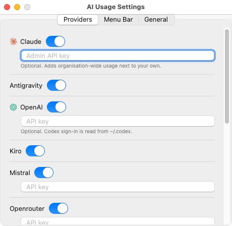
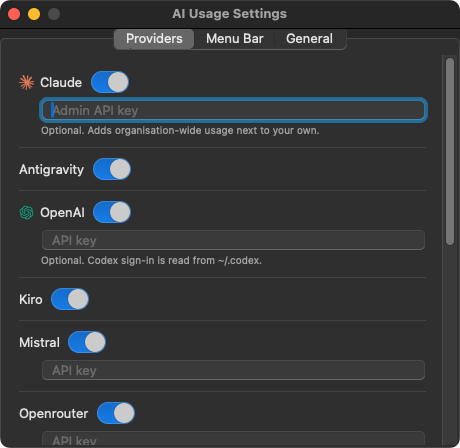

# AI Usage on macOS

A menu bar app: the active provider's mark and its percentages in the menu
bar, and a popover under it with the quota windows, their reset countdowns and
the usage history.

<p align="center">
  
  
</p>
<p align="center">
  
  
</p>

Screenshots use demo data.

## Frontend choices

Swift is the supported macOS frontend. AppKit's `NSStatusItem` and `NSPopover`
provide the menu bar item and popover, while SwiftUI renders the usage and
settings views. Credential discovery, provider requests, quota calculations,
and history remain in the shared Python backend.

The Hyprland frontend uses Quickshell. The Windows app (`windows/app.py`)
uses PySide6 to host shared Hyprland QML. That host is a possible starting
point for an experimental Qt frontend on macOS, but this repository does not
currently build, test, or package it for Mac users. Treat it as unverified.

Supporting it as a second option would require macOS smoke tests, tray and
popup interaction checks, and a separate bundle and distribution process.
For now, the native app is the documented macOS option. Its provider-agnostic
contract means new backend providers do not need their own Swift views; see
[the provider contract](provider-contract.md).

## Python on macOS

macOS ships no Python anyone can rely on. `/usr/bin/python3` is a stub that
offers to install the Xcode command line tools; there is no `python3` for a
user who has never opened a terminal.

So `AI Usage.app` carries its own, frozen with PyInstaller into
`Contents/Resources/backend/`. This is cheap precisely because the backend is
standard-library-only — there are no wheels to build, no native extensions to
sign, and the whole thing is about 15 MB. The one exception is `psutil`, which
only Antigravity needs (it finds the IDE's language server among the user's own
processes, which `/proc` answers on Linux and nothing answers on macOS), and it
is bundled too.

The app looks for its backend in this order:

1. `$AI_USAGE_BACKEND`, if set — how a checkout runs against the working tree,
   and how CI points it at a fixture
2. `Contents/Resources/backend/ai-usage-backend` — the release build
3. `package/contents/tools/sh/get-ai-usage`, walking up from the executable —
   a `swift run` out of a checkout

The terminal frontend (`ai-usage-cli`) is a separate matter: it is a shell
script that needs a Python of its own, so a Mac user who wants it needs
`brew install python` or equivalent. The app does not.

## Where things are on macOS

Both directory conventions are genuinely in use on a Mac — a tool written
against XDG keeps reading `~/.config` there, and one built on a cross-platform
directories library lands in `~/Library/Application Support` — so `paths.py`
offers both, best first, and the provider picks whichever exists.

| | on macOS | fixed in |
| --- | --- | --- |
| Claude Code login | login Keychain, service `Claude Code-credentials` | `claude_credentials.py` |
| cursor-agent login | login Keychain, service `cursor-access-token` | `cursor.py` |
| Muse key | login Keychain, service `ai.meta.dev.credentials` | `muse_quota.py` |
| Codex login | `$CODEX_HOME/auth.json`, or the Keychain when configured for it | `openai_credentials.py` |
| kiro-cli | `~/Library/Application Support/kiro-cli/data.sqlite3` | `kiro.py` |
| Cursor / Kiro IDE | `~/Library/Application Support/<IDE>/User/globalStorage/state.vscdb` | `paths.py` |
| `gh` / Copilot | the Keychain, read by `gh auth token` itself | nothing to do |
| everything else | XDG, as on Linux | nothing to do |

Every Keychain read goes through `/usr/bin/security`, never the Security
framework, and that is not a shortcut — it is the only way that does not
prompt. These items are created by the vendor's own tool running `security`,
which leaves the item's ACL trusting `/usr/bin/security` and its partition list
holding `apple-tool:` — a list no third-party signature can join, and one that
"Always Allow" does not edit. Read through the framework, a widget polling
every five minutes would raise the "wants to access your keychain" dialog on
every poll, forever. Asking the same Apple-signed tool raises none, whatever
this app is signed with. See `aiusage/keychain.py`.

Nothing here ever refreshes a token. Anthropic allows one live refresh token
per client, so a refresh from this widget would sign the user out of Claude
Code itself.

### The widget's own files

`~/.config/ai-usage-widget/` and `~/.local/share/ai-usage-widget/`, the same as
on Linux — deliberately, not by omission. The settings file and the usage
history are shared with `ai-usage-cli` and with any Linux machine the user syncs
dotfiles from; moving them to `~/Library/Application Support` on macOS alone
would mean pasting every API key twice and keeping two histories.

## Building

```bash
python3 -m pip install -r macos/packaging/build-requirements.txt
macos/scripts/build-app.sh                   # universal, with the frozen backend
macos/scripts/build-app.sh --arch arm64      # this machine only, much faster
macos/scripts/build-app.sh --skip-backend    # runs against the checkout
swift test --package-path macos              # the suites that need no window
```

There is no Xcode project: SwiftPM compiles the executable and the script
assembles the bundle around it, so the whole build reviews as a diff. The
provider logos are the widget's own SVGs, compiled into an asset catalog by
`actool` (which ships with Xcode) so they stay vectors — one file draws
crisply at 16 points in the menu bar and at 32 in the popover. The `.icns`
needs a rasteriser; `brew install librsvg` supplies one, and without it the
build warns and carries on with the generic Finder icon.

### Seeing it without a Mac

The app's `--selftest` and `--screenshot <dir>` switches render the views with
no menu bar and exit, the way `windows/app.py` does.
`scripts/demo-envelope.py` feeds them a contract-shaped envelope built
from `tests/fixtures/`, so the screenshots need no credentials, reach no
network, and come out the same every time. `.github/workflows/macos.yml` runs both on a
`macos-14` runner and uploads the results.

## The menu bar item

Three icon styles, in Settings › Menu Bar:

| | |
| --- | --- |
| **Monochrome** (default) | one template logo at the left, the percentages beside it. What macOS wants: a template image inverts with the menu bar, dims with the app, and stays legible over any wallpaper |
| **One per value, tinted** | a logo beside *every* value, filled with that value's colour — the panel pill's layout, where "the logo contributes its shape and the backend its colour" (`hyprland/PanelSlot.qml`), so severity is read off the icon |
| **One per value, brand colours** | the same layout in the brand's own artwork |

The per-value logos are `NSTextAttachment`s inside the item's attributed title
rather than the button's image, because a button has one image and this layout
wants one per reading.

Monochrome is the default on purpose rather than by omission. A coloured menu
bar item does not invert, does not dim when the app is inactive, and fights
whatever is behind it. The other two are there because the Plasma widget and
the Hyprland pill both show colour and somebody moving between them may want
the same thing — see `menubar-*.png` in the CI artifact and decide by looking.

## Translations

The app reads `translate/<lang>.po` — the same catalogs the Quickshell panel
and the Windows tray app read — rather than carrying a `.lproj` or a String
Catalog of its own. A second set of translation files for one application means
a translator does the work twice, and `translate/fr.po` already holds
"Paramètres", "Actualiser" and "Réinitialisation dans %1"; using the same
msgids means a string the QML frontends translated is translated here the
moment it is used.

`Catalog.swift` is a port of `package/contents/code/I18n.js` — same parsing,
same fuzzy/obsolete/untranslated rules, same `%1` placeholders, same ki18n call
shapes. The one deliberate difference is plural forms: I18n.js compiles the
header's C expression at runtime, which Swift cannot do, so the three rules our
catalogs use are recognised by name and anything else falls back to English's.

`translate/Messages.sh` extracts the Swift in a second `xgettext` pass with the
C parser (there is no Swift backend) and merges it with `msgcat`. A string held
in a table rather than shown directly — the settings page's per-provider key
labels — is marked with `i18nNoop()` where the table is built and translated
where it is shown. `tests/python/test_macos_i18n.py` holds all of that
together: no interpolation inside a msgid, no bare `Text("…")`, placeholders
numbered from one, and the strings shared with the QML frontends spelled
identically. It caught the first one on its first run — the menu item said
"Settings…" where the catalog had "Settings", so it would have shipped in
English next to a translation that already existed.

## Signing and distribution

Ad-hoc signed, which is enough to run: the Keychain reads go through
`/usr/bin/security` and do not care what this app is signed with. Gatekeeper
still does — an unsigned download is quarantined, and the first launch needs a
right-click → Open (or `xattr -dr com.apple.quarantine "/Applications/AI Usage.app"`).

Notarising it properly needs an Apple Developer account at $99/year, which is a
decision for the project and not a technical one. `AI_USAGE_SIGN_IDENTITY`
makes the build script use a real identity when there is one.

## CI

`.github/workflows/macos.yml` builds the app on a `macos-14` runner, runs the
Swift suites and the Python ones, and uploads the screenshots as a
`screenshots` artifact. Download the artifact from the workflow run to inspect
the full gallery.

The app bundle includes the frozen Python backend. CI smoke-tests its provider
listing, offline fixture normalization, and history loading before switching
to the shared demo script for screenshots.

`--screenshot` photographs the **running app**, not a render of its views. The
first version used SwiftUI's `ImageRenderer`, which cannot rasterise an
AppKit-backed control: every `Menu`, segmented `Picker` and `TabView` came out
as a yellow "prohibited" box, so the provider picker, the overflow menu and the
whole settings window were missing from the shots, and the popover's material
and arrow never appeared at all. Now the real popover opens under the real
status item and `screencapture` takes that window — what comes out is what a
user sees. Where the window server declines, it falls back to the window
drawing itself into a bitmap, which keeps the real controls even though it
loses the material behind them.

Eleven shots come out, uploaded as the run's `screenshots` artifact:

| | |
| --- | --- |
| `menubar-monochrome` / `-tinted` / `-brand` | the right-hand end of the menu bar, one shot per icon style — the equivalent of the README's panel-pill pictures. No light and dark versions: the system menu bar does not follow an application's appearance, so there is nothing different to photograph |
| `popover-light` / `-dark` | the popover as it opens |
| `popover-expanded-light` / `-dark` | with the usage history and the activity statistics open |
| `screen-light` / `-dark` | the whole display, item and popover together |
| `settings-light` / `-dark` | the settings window |

The session hashes every shot and fails the run when two come out identical.
That has earned itself twice: once on a capture that raced the compositor and
handed back the previous frame, and once on the two menu bar shots that could
never have differed in the first place.

Changes under `macos/` also trigger the portable backend checks in `lint.yml`,
including the Swift/Python contract tests. Swift source changes trigger the
translation checks too.

## Not done yet

- Signing and notarisation, and a Homebrew cask
- A release job building the universal `.app` and attaching a `.dmg`
- Interactive checks on a personal Mac: multiple displays, menu bar placement,
  credential discovery, and login-item behavior. CI screenshots do not cover
  those interactions.
